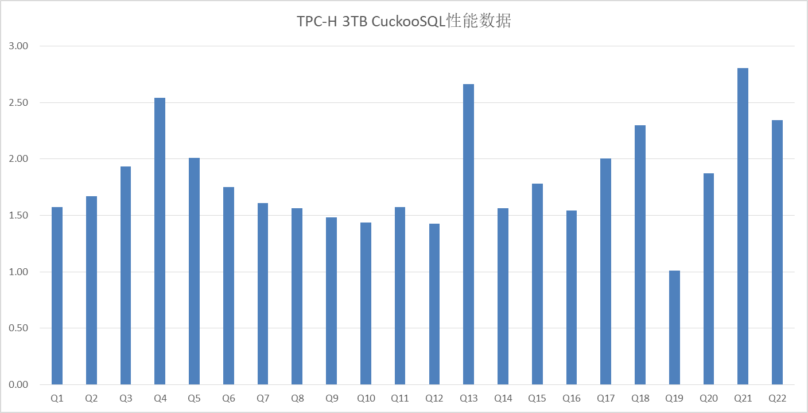

# CuckooSQL
#### 介绍  
    一种C++实现的Spark SQL Native引擎解决方案，基于Spark提供的Extension功能插件式实现无需侵入修改代码。使用Apache Arrow列式内存布局实现向量化，动态代码生成和静态编译组合并结合LLVM动态优化生成代码，提升Spark SQL的性能。

#### 软件版本
    目前支持spark：3.1.1  

#### 安装步骤

1.  下载CuckooSQL.tar.gz，解压到自定义目录`$path`  
    `tar -zxf CuckooSQL.tar.gz -C $path`
    
2.  在spark的spark-defaults.conf文件中增加以下配置  
    #设置启动spark时使用的so文件和jar包  
    `spark.driver.extraLibraryPath $path`  
    `spark.executor.extraLibraryPath $path`  
    `spark.driver.extraClassPath  $path/kal_luca_engine_kernel-1.0.0.jar:$path/kal_luca_engine_sparksql-1.0.0.jar`  
    `spark.executor.extraClassPath $path/kal_luca_engine_kernel-1.0.0.jar:$path/kal_luca_engine_sparksql-1.0.0.jar`  

    #设置使用CuckooSQL插件  
    `spark.sql.extensions kal.luca.spark.LucaPlugin`  
    `spark.shuffle.manager org.apache.spark.shuffle.sort.LucaShuffleManager`  
    
    #shuffle开启压缩（可选配置）  
    `spark.kal.luca.shuffle.enableCompress true` 

#### 使用说明
    具体使用步骤和开源Spark SQL保持一致  

#### 性能验证
    在鲲鹏920 1 server + 3 slaves 服务器集群上，使用TPC-H 3TB数据量验证，性能提升如下：

#### 备注
1.  目前只支持parquet数据格式  
2.  可查看执行计划中算子已替换为CuckooSQL算子，如Filter->LucaFilter  
3.  如果SQL语句中有不支持的算子或者表达式等，则fallback到原生算子 